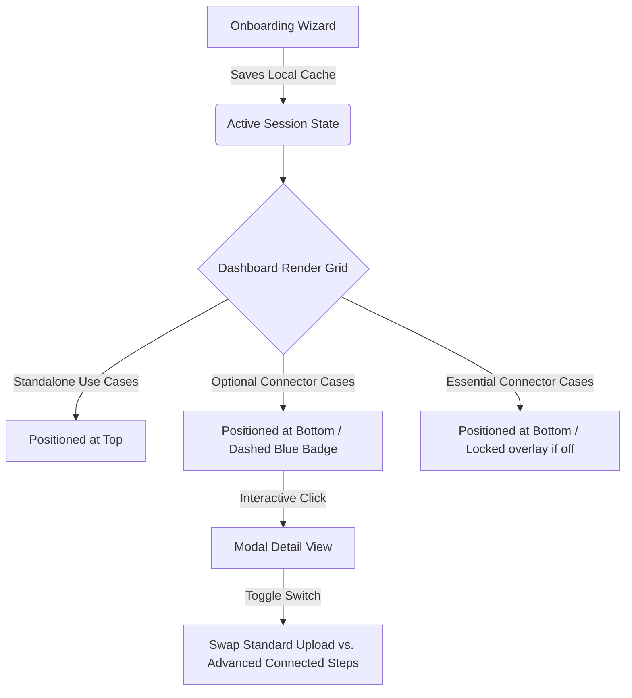

# Gemini Enterprise - Edu Portal Developer Guidelines (`AGENT.md`)

This document serves as the persistent single source of truth for the **Google Gemini Enterprise Education Adoption & Playbook Portal**. It outlines the technology stack, specific coding and terminology preferences, design guidelines, and the current implementation state.

---

## 1. Technology Stack & Architecture

The application is built entirely as a high-performance, single-page client-side web application. It requires no backend database server or runtime compiling.

* **Markup:** Standard HTML5 using semantic layout elements (`<aside>`, `<main>`, `<article>`, etc.).
* **Styles:** Vanilla CSS utilizing deep custom property trees (CSS Variables) for global theme tokens (colors, gradients, glassmorphism blur, borders, typography scale). **TailwindCSS is strictly avoided** to maintain fine-grained layout control.
* **Logic:** Vanilla ES6+ JavaScript.
  * **State Machine:** Governed by a reactive `appState` object. Any mutations to this state (e.g. toggling role filters, searching, or switching themes) instantly trigger UI re-renders without full-page reloads.
  * **Datastore:** Governed by an in-memory client-side default array (`useCasesDb`) dynamically enriched at boot-time with translation layers and advanced multi-state connectors.
  * **Localization:** Programmatic static dictionary mapping (`uiTranslations`) and nested multi-lingual database trees (`useCasesTranslations`) supporting English (`en`), Traditional Chinese (`zh-TW`), and Simplified Chinese (`zh-CN`).

---

## 2. Terminology & Brand Boundaries

Strict guidelines govern how features, products, and connectors are named. These boundaries must be strictly observed in all UI elements and translations:

### Approved Terminology
* **Enterprise Title:** `Gemini Enterprise - Edu Portal` (Avoid *"Antigravity"* or general references).
* **Main Models & Features:** `NotebookLM` (Never refer to it as *"NotebookLM Enterprise"*), `Gemini`, `Canvas Mode`, `Deep Research`, `Agent Designer`, `Image Generation` (Never use *"Nano Image Gen"*), `Video Generation`.

### Forbidden Terminology
* **Never** use the term **"Gem"** (always use **"Agent"**).
* **Never** use the term **"Copilot"**.

### Localization Boundary
* Keep product and system names (*NotebookLM*, *Gemini*, *Canvas Mode*, *Deep Research*, *Agent Designer*, *Image Generation*, *Video Generation*) strictly in **English** within both Traditional Chinese (`zh-TW`) and Simplified Chinese (`zh-CN`) translations.

---

## 3. Design Aesthetics & Legibility Rules

The portal is designed with a premium, state-of-the-art aesthetic that shifts dynamically between light and dark modes:

* **Dark/Light Mode Theme Variable Management:**
  * Backgrounds, borders, and main cards are driven by CSS variables (e.g., `--bg-primary`, `--border-glass`).
  * Ggradient title elements (like `.welcome-msg`) use dynamic color variables (`var(--welcome-msg-start)` and `var(--welcome-msg-end)`) to prevent low-contrast text failures in light mode. In light mode, headings shift gracefully to elegant dark slate/steel colors rather than retaining light/white gradients.
* **Icon Softening:**
  * Utility icons inside side panels and secondary items use soft muted colors (`var(--text-muted)`) rather than stark black/white colors, ensuring a quiet, premium aesthetic that lights up elegantly on active hover states.
* **No Placeholders:**
  * Standard icons are rendered using the Google Material Symbols Outlined font library.
  * Overlapping UI buttons (such as the **Copy Prompt** button in the sandbox drawer) are properly padded to ensure clear separation and zero element overlapping.

---

## 4. Connector & Dynamic State Logic

The portal supports intelligent integration simulation via simulated enterprise connector toggles:

* **Nomenclature:**
  * All connector components are named generically in user-facing toasts and badges to ensure product agnosticism (e.g., **Drive Connector**, **Email Connector**, **Calendar Connector**, **LMS Connector**) rather than referencing vendor-specific software (like *Outlook* or *OneDrive*).
* **Essential Connectors vs. Optional Connectors:**
  * Use cases that strictly require an active integration (e.g., **Daily Academic Email Digest & Priority Planner**) carry a `connectorEssential: true` tag. These cards strictly show a locked overlay on the dashboard when their corresponding connector is toggled off.
  * Use cases where integrations are secondary enhancements (e.g. *Sentiment Feedback*, *Activities Calendar*) are tagged with `connectorEssential: false`. These cards remain **unlocked** on the dashboard and accessible to click at all times.
* **Modal Advanced Toggle:**
  * Inside the detailed modal view for non-essential connector use cases, an interactive slider checkbox ("Extend to Advanced Usage with Connectors") is rendered.
  * Toggling this checkbox instantly swaps the steps, prompts, and pro-tips between standard manual file upload variants and active cloud connector workflows.

---

## 5. Current Implementation State

The following components are 100% verified, implemented, and operational:

* **Instant Translation Chain:** Switching languages immediately translates the sidebar role and "My Context Profile" overlay card in real-time without requiring a browser reload.
* **Product-Agnostic Notifications:** Connector activation triggers generic, clean confirmation toasts in all three supported languages.
* **Sorting Hierarchy:** Standalone tools programmatically float to the top of each category, while connector-dependent tools (both essential and optional) are neatly aligned at the bottom of the grid.

---

## 6. App State & Progress

### Accomplished Tasks (Latest Session Milestone)
* **Swiss Minimalism Redesign:** Redesigned the entire portal layout and styling using a high-fidelity, premium Swiss Minimalist visual identity.
  * **Engineering Grid Background:** Replaced generic background blobs with a subtle, precision 32x32px coordinate graph-paper grid matching the scholastic/architectural aesthetic.
  * **High-End Razor Icons:** Globally overrode the Google Material Symbols Outlined icons weight parameter (`wght` set to `200` via CSS variation settings) to turn bulky default shapes into delicate, thin-line glyphs.
  * **Precision Layout Spacing:** Removed all drop shadows and heavy glass blurs in favor of absolute flat solid container surfaces, crisp margins, and ultra-thin hairline dividers (`1px solid var(--border-hairline)`).
  * **Modernist Border Radius:** Standardized all box corners, cards, inputs, and buttons to a sharp, professional `4px` corner radius.
  * **Active Focus Stripe:** Designed a beautiful active animation where hovering a card smoothly slides in a 2px vertical accent bar on its left edge while its borders sharpen.
  * **Diagonal Shading Locked States:** Redesigned off-connector card locked screens with a clean diagonal striped pattern overlay (`repeating-linear-gradient`) and crisp flat unlocking actions, preserving underlying text legibility.
  * **Pristine Color Contrast:** Curated slate, zinc, and obsidian values for dark mode, and pure warm paper-alabaster textures for light mode, anchored by single, disciplined Indigo accents.
  * **100% Logic Preservation:** Retained all JavaScript state mutations, translations, and selector references intact.

### Next Concrete Actions
1. **User Visual Verification:** Prompt the user to open the portal and evaluate the new layout, ensuring the Swiss engineering aesthetic resonates perfectly.
2. **Interactive Flow Review:** Verify onboarding form submissions, language switches (English, Traditional Chinese, Simplified Chinese), feature filters, and connector toggle activations under both light and dark modes.
3. **Drawer Sandbox Polish:** Open multiple card modals to inspect the crispness of step layouts, code prompt sandboxes, and green-glowing active state connections under the new theme.

