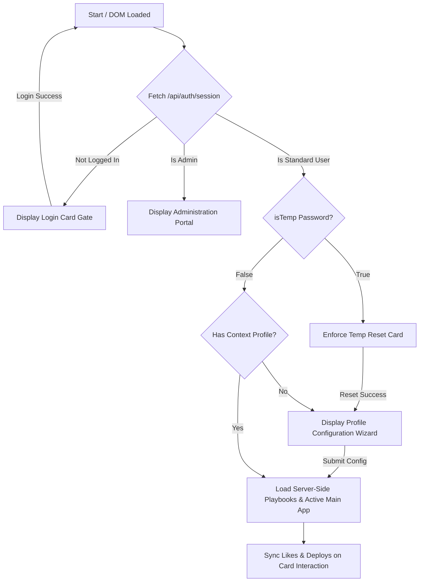

# Gemini Enterprise - FSI Portal Developer Guidelines (`AGENT.md`)

This document serves as the persistent single source of truth for the **Google Gemini Enterprise FSI Adoption & Playbook Portal**. It outlines the technology stack, specific coding and terminology preferences, design guidelines, and the current implementation state.

> [!IMPORTANT]
> **Bug-Fixing & Troubleshooting Rule:** For any future bug fixing or troubleshooting, you MUST try to read from the live server/container logs first to pinpoint the exact error before making guesses about what is wrong.

---

## 1. Technology Stack & Architecture

The application is built as a high-fidelity, dynamic web application supported by a secure containerized Node.js backend.

* **Backend Server:** Node.js + Express framework (`server.js`) powering dynamic REST APIs, session storage, and database management.
* **Dual Database Layer:**
  * **Production (PostgreSQL):** Production-ready pool configuration (`pg`) optimized for container scaling on Google Cloud Run.
  * **Local/Offline Fallback (SQLite):** File-based SQLite (`fsi_portal.db`) with automatic table structures creation.
* **VM Sandbox Seeding Module:** Securely parses and extracts 14 static financial/operational playbooks and translations from `app.js` on first boot inside an isolated Node `vm` context, eliminating seed duplication. Includes a 6-month historical log generator to populate visual analytics out-of-the-box.
* **Authentication Gateways:** Enforced via `express-session` cookies and `bcryptjs` hashing.
  * **Master Admin Account:** `fsi_portal_s_admin` (Password configured via `SUPER_ADMIN_PASSWORD` env variable; default local fallback: `'SuperAdmin_ChangeMe_2027'`).
  * **Admin Assist Account:** `fsi_portal_admin` (Password configured via `ADMIN_PASSWORD` env variable; default local fallback: `'Admin_ChangeMe_2027'`, cannot Create, Update, or Delete use case playbooks).
  * **Standard Accounts:** Email-based provisioning with auto-generated 10-character temp passwords. Force-reset of credentials is strictly enforced on first login.
  * > [!WARNING]
    > **Credentials Security Warning:** There is **no recovery mechanism** for custom administrative or master bypass passwords set in this portal. Any administrative password overrides must be securely documented and kept safe.
* **Markup & Client Logic:** Vanilla HTML5 paired with modular ES6+ client-side logic (`app.js`). Hydrates page templates dynamically from `/api/use-cases` on session validation.
* **Styles & Visual Identity:** Pure Swiss Minimalism Vanilla CSS (`style.css`), powered by CSS variable maps. **TailwindCSS is strictly avoided** to preserve precise typographic scale and structural grids.

---

## 2. Terminology & Brand Boundaries

Strict guidelines govern how features, products, and connectors are named. These boundaries must be strictly observed in all UI elements and translations:

### Approved Terminology
* **Enterprise Title:** `Gemini Enterprise - FSI Portal` (Avoid *"Antigravity"* or general references).
* **Main Models & Features:** `NotebookLM` (Never refer to it as *"NotebookLM Enterprise"*), `Gemini`, `Canvas Mode`, `Deep Research`, `Agent Designer`, `Image Generation` (Never use *"Nano Image Gen"*), `Video Generation`.

### Forbidden Terminology
* **Never** use the term **"Gem"** (always use **"Agent"**).
* **Never** use the term **"Copilot"** in general user-facing UI descriptions, except inside specifically designated role tools like "Equity Research Copilot".

### Localization Boundary
* Keep product and system names (*NotebookLM*, *Gemini*, *Canvas Mode*, *Deep Research*, *Agent Designer*, *Image Generation*, *Video Generation*) strictly in **English** within both Traditional Chinese (`zh-TW`) and Simplified Chinese (`zh-CN`) translations.

---

## 3. Design Aesthetics & Legibility Rules

The portal is designed with a premium, state-of-the-art aesthetic that shifts dynamically between light and dark modes:

* **Dark/Light Mode Theme Variable Management:**
  * Backgrounds, borders, and main cards are driven by CSS variables (e.g., `--bg-primary`, `--border-glass`).
  * Gradient title elements (like `.welcome-msg`) use dynamic color variables (`var(--welcome-msg-start)` and `var(--welcome-msg-end)`) to prevent low-contrast text failures in light mode. In light mode, headings shift gracefully to elegant dark slate/steel colors rather than retaining light/white gradients.
* **Icon Softening:**
  * Utility icons inside side panels and secondary items use soft muted colors (`var(--text-muted)`) rather than stark black/white colors, ensuring a quiet, premium aesthetic that lights up elegantly on active hover states.
* **No Placeholders:**
  * Standard financial and operations icons are rendered using the Google Material Symbols Outlined font library.
  * Overlapping UI buttons (such as the **Copy Prompt** button in the sandbox drawer) are properly padded to ensure clear separation and zero element overlapping.

---

## 4. Connector & Dynamic State Logic

The portal supports intelligent integration simulation via simulated enterprise connector toggles:

* **Nomenclature (5-Connector Model):**
  * All connector components are named generically in user-facing toasts and badges to ensure product agnosticism (e.g., **Document Store Connector**, **Email Connector**, **CRM Connector**, **Calendar Connector**, **Service Desk & KB Connector**) rather than referencing vendor-specific software (like *SharePoint*, *Salesforce*, or *Jira*).
* **Essential Connectors vs. Optional Connectors:**
  * Use cases that strictly require an active integration (e.g., **Daily Correspondence Summary**) carry a `connectorEssential: true` tag. These cards strictly show a locked overlay on the dashboard when their corresponding connector is toggled off.
  * Use cases where integrations are secondary enhancements are tagged with `connectorEssential: false`. These cards remain **unlocked** on the dashboard and accessible to click at all times.
* **Modal Advanced Toggle:**
  * Inside the detailed modal view for non-essential connector use cases, an interactive slider checkbox ("Extend to Advanced Usage with Connectors") is rendered.
  * Toggling this checkbox instantly swaps the steps, prompts, and pro-tips between standard manual file upload variants and active cloud connector workflows.

---

## 5. Current Implementation State

The following dynamic authorization, session gating, and admin workflows are 100% verified, compiled, and operational:



* **Instant Translation Chain:** Language switches translate the full portal, sidebar filters, active user context metrics, and interactive toasts in real-time.
* **Product-Agnostic Notifications:** Simulating connectors issues clean native toasts, fully localized across English (`en`), Traditional Chinese (`zh-TW`), and Simplified Chinese (`zh-CN`).
* **Interactive Preferences (Likes/Deployments):** Standard use case cards carry responsive heart and rocket icons that bypass detail popups, updating preference tables dynamically on the server database.
* **SVG Vector Graph Charts:** The admin statistics view aggregates database events and paints high-contrast line charts showing Page Views, Likes, and Deployments over the last 6 months.

---

## 6. Cloud Run Production Deployment

The production environment is deployed and scaled on **Google Cloud Run** to serve the active user base with high-availability:

* **Service Name:** `fsi-ge-learning-portal`
* **GCP Project:** `ge-fsi-demo`
* **Active Region:** `asia-east2` (Hong Kong)
* **Access Mode:** Domain-restricted access (enforced via active Organization Policies). Public unauthenticated access can be added by temporarily bypassing domain restriction constraints.

### Standard Deployment & Release Workflow

To compile and deploy updates or new releases of the portal to the live production environment, follow this standardized step-by-step workflow:

1. **Verify Local Assets & Configuration:**
   * Ensure that `style.css`, `app.js`, `index.html`, and `server.js` contain no syntax errors and all dynamic references are correct.
   * Verify that local testing configurations do not override the production database environment values.

2. **Update Developer Guidelines (`AGENT.md`):**
   * Before committing, always update the **App State & Progress** section of `AGENT.md` to document the completed changes, bug fixes, or new features, along with any concrete next steps.

3. **Commit and Push Code to Remote Repository:**
   * Stage all updated files including modified codebase assets and the updated `AGENT.md` file.
   * Commit with a descriptive message and push to the remote git branch:
     ```bash
     git add .
     git commit -m "feat/fix: descriptive release commit message"
     git push
     ```

4. **Authenticate with Google Cloud SDK:**
   * Ensure you are authenticated with your authorized Google Cloud developer account:
     ```bash
     gcloud auth login
     ```

5. **Deploy Codebase to Google Cloud Run:**
   * Execute the standardized source-deployment command in your terminal within the root directory of the repository:
     ```bash
     gcloud run deploy fsi-ge-learning-portal --source . --region asia-east2 --allow-unauthenticated --project ge-fsi-demo
     ```

6. **Verify Access & Organization Policies:**
   * If organization policies block public unauthenticated access, log in using your workspace domain credentials to access the production URL.

---

## 7. App State & Progress

### Accomplished Tasks (FSI Transition Milestone)
* **Standardized Product-Agnostic Connectors (100% Complete):**
  * Integrated a premium **5-Connector Model** containing Document Store, Email, CRM, Calendar, and Service Desk & KB Connectors.
  * Standardized connector naming conventions generically to preserve brand boundaries.
* **Expanded FSI Role Coverage (100% Complete):**
  * Transitioned all 9 legacy educational roles to 12 precise, industry-specific FSI personas (Financial Analyst, Relationship Manager, Underwriter, Loan Officer, Compliance Officer, Risk Manager, etc.).
* **FSI Adoption Blueprint Formulation (100% Complete):**
  * Drafted a comprehensive translation, database, and setup transition blueprint inside [fsi_adoption_plan.md](file:///Users/roycheung/.gemini/antigravity-cli/brain/04a14f2e-59e6-4f72-8bdc-aa96c1d25c42/fsi_adoption_plan.md).
* **Package, HTML & Database Path Renaming (100% Complete):**
  * Renamed local fallback SQLite file to `fsi_portal.db`.
  * Fully updated `package.json`, `server.js`, and `index.html` to reflect the new repository path (`ge_learning_portal_fsi`) and secure credential variables.
  * Updated Terraform configurations (`variables.tf` and `main.tf`) to align service names and input variables.
* **Multilingual FSI Playbook Hydration (100% Complete):**
  * Rewrote `app.js` with all 15 FSI playbooks, uiTranslations, and useCasesTranslations fully localized across English (`en`), Traditional Chinese (`zh-TW`), and Simplified Chinese (`zh-CN`).
* **Local Schema Bootstrap Verification (100% Complete):**
  * Deleted the old `edu_portal.db` file.
  * Verified that the server compiles `app.js` dynamic seeder scripts without any syntax errors, seeds `fsi_portal.db` use cases, and starts listening on port 8080 cleanly.
* **Cloud Run Session & Login Persistence Fix (100% Complete):**
  * Set up `trust proxy` inside Express when running on Google Cloud Run to correctly parse SSL headers.
  * Migrated the session configuration to dynamically enable `secure` cookies in production HTTPS.
  * Updated `/api/auth/login` and `/api/auth/reset-password` endpoints to use explicit, blocking `req.session.save()` operations, guaranteeing the browser successfully receives and persists the active cookie before client-side page reload.
* **Log-First Bug-Fixing Rule Integration (100% Complete):**
  * Enforced a strict debugging standard inside `AGENT.md` to always read live container logs (using `gcloud logging read`) before guessing or deploying code changes.
  * Extracted and audited latest Google Cloud Run request logs and startup logs to guide future diagnostics.
* **Global `appState` Declaration in Client Logic (100% Complete):**
  * Discovered that the global client-side state manager `appState` was completely undeclared, throwing severe `ReferenceError` crashes in the browser console when writing authenticated session properties immediately after a successful login.
  * Declared and initialized the complete `appState` schema cleanly at the top of `app.js`, restoring login dashboard navigation and correcting the visual freeze.
* **Resolved Playbook Grid, Checklist, and Language Mismatches (100% Complete):**
  * **Interactive Role Filtering:** Replaced legacy filter logic in `renderUseCases()` and `isUsecaseRelatedToRole()` to correctly evaluate and display playbooks based on FSI category hubs and roles, eliminating the empty playbook grid bug.
  * **Simulation and Onboarding Defaults:** Changed all old academic default fallbacks (e.g. `"Lecturer"`, `"University & College"`) inside `initApp()`, admin dashboard view restoration, and new playbook template forms to `"Financial Analyst"` and `"Banking"`.
  * **AI Draft Parsing:** Upgraded the custom template CSV/AI drafting parser in `applyGeminiSuggestions()` to map key role descriptors to the correct FSI roles (e.g. analyst, advisor, claims, compliance, risk, security).
  * **Profile Context and Header Sync:** Patched `updateSidebarContextUI()` to display the document title as `Gemini Enterprise - FSI Adoption Portal` and support FSI support roles (`Security Officer`, `IT Operator`, `HR Consultant`).
  * **Database Seeding and Onboarding Fix:** Modified `server.js`'s test-user seeding function to configure default `test-user@google.com` with role `"Financial Analyst"` and sector `"Banking"`, resolving the missing default role dropdown on onboarding.
  * **Zero Client-Side Render Crashes:** Fixed the uncaught `TypeError` crash caused by missing `hubs` dictionary in language translations, restoring fully functional real-time language switching across English, Traditional Chinese (`zh-TW`), and Simplified Chinese (`zh-CN`) for both User and Admin portals.
* **Tactile Soft-Instrument Neumorphism Redesign (100% Complete):**
  * **Unified Token Shadow Maps:** Added high-precision light bleed and shadow coordinates (`--shadow-neumorphic-out`, `--shadow-neumorphic-out-sm`, `--shadow-neumorphic-in`, `--shadow-neumorphic-in-sm`) across dark mode Charcoal Obsidian (`#1e222b`) and light mode Clinical Slate-Grey (`#e6eef4`).
  * **Convex Extruded Cards:** Restyled `.glass-panel`, `.card`, and `.modal-content-card` to lift seamlessly out of the background surface with smooth curved borders (`var(--border-radius-neumorphic)`), rising gently on hover.
  * **Tactile Button Sinks:** Configured `.nav-button` and `.nav-button-primary` as mechanical tactile buttons that float when idle, rise on hover, and sink recessed into the board (`inset` shadow) on click.
  * **Sunken Form Fields & Sockets:** Redesigned `.select-control`, `.search-input`, and checkbox indicators (`.roadmap-checkbox-indicator`) to look physically recessed into the canvas with soft shadow contours.
  * **Physical Toggle Slider Channels:** Refactored toggles into beautiful hollowed inset track slots with high-contrast convex spherical knobs.
  * **Cohesive Desktop Floating Sidebar:** Programmed `.sidebar` as a floating rounded console plate that floats beautifully over the workspace background with deep tactile shadow depth on desktop screens, falling back cleanly to responsive full-screen menus on mobile.
  * **Skeuomorphic Circular Brand Indicator Logo:** Upgraded the brand mark to a beautiful circular technical lens dial with outer and inner shadow maps, glowing on hover.
  * **Full Localized Side Panel Translations:** Dynamically integrated all static sidebar title headers, portal view selectors, category filter tabs, requirement filter links, search bar placeholder, and individual connector description toggles across English, Traditional Chinese (`zh-TW`), and Simplified Chinese (`zh-CN`), fixing the translation gaps.
  * **Brackets / Parentheses Polish:** Cleaned up all dynamic and static Chinese texts inside `uiTranslations` to strip duplicate English parenthesized name repetitions, restoring absolute visual cleanliness.
  * **Card Badge Synchronisation:** Synced usecase card tags and lockout warnings to look up same premium localized connector names.

### Next Steps & Continuous Polish
1. **Container Build & Live Production Release:** Compile, verify, and push changes live to Google Cloud Run and verify access.
2. **Review User Feedback:** Review user interactions with the newly released soft-instrument design.
