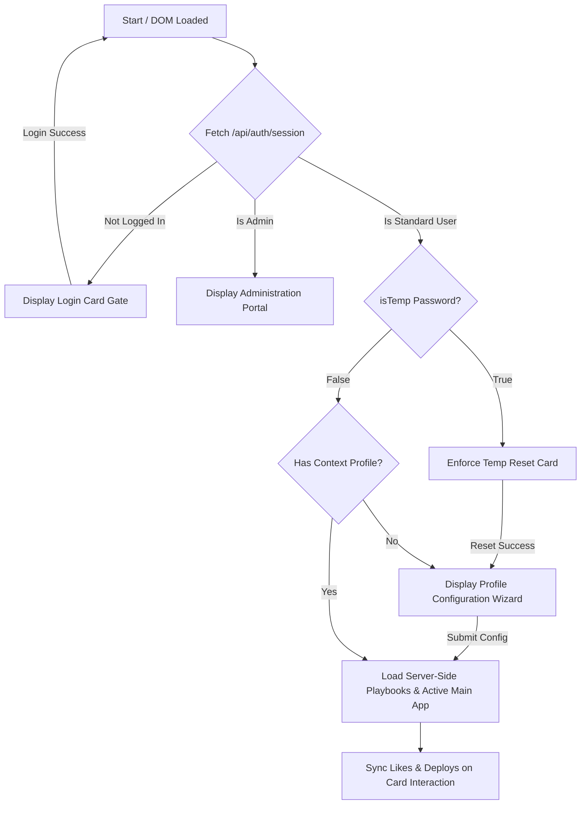

# Gemini Enterprise - Edu Portal Developer Guidelines (`AGENT.md`)

This document serves as the persistent single source of truth for the **Google Gemini Enterprise Education Adoption & Playbook Portal**. It outlines the technology stack, specific coding and terminology preferences, design guidelines, and the current implementation state.

---

## 1. Technology Stack & Architecture

The application is built as a high-fidelity, dynamic web application supported by a secure containerized Node.js backend.

* **Backend Server:** Node.js + Express framework (`server.js`) powering dynamic REST APIs, session storage, and database management.
* **Dual Database Layer:**
  * **Production (PostgreSQL):** Production-ready pool configuration (`pg`) optimized for container scaling on Google Cloud Run.
  * **Local/Offline Fallback (SQLite):** File-based SQLite (`edu_portal.db`) with automatic table structures creation.
* **VM Sandbox Seeding Module:** Securely parses and extracts 14 static scholastic/operational playbooks and translations from `app.js` on first boot inside an isolated Node `vm` context, eliminating seed duplication. Includes a 6-month historical log generator to populate visual analytics out-of-the-box.
* **Authentication Gateways:** Enforced via `express-session` cookies and `bcryptjs` hashing.
  * **Master Admin Account:** `edu_portal_s_admin` with password `HKEduDemo2026`.
  * **Admin Assist Account:** `edu_portal_admin` with password `HKEduDemo` (cannot Create, Update, or Delete use case playbooks).
  * **Standard Accounts:** Email-based provisioning with auto-generated 10-character temp passwords. Force-reset of credentials is strictly enforced on first login.
* **Markup & Client Logic:** Vanilla HTML5 paired with modular ES6+ client-side logic (`app.js`). Hydrates page templates dynamically from `/api/use-cases` on session validation.
* **Styles & Visual Identity:** Pure Swiss Minimalism Vanilla CSS (`style.css`), powered by CSS variable maps. **TailwindCSS is strictly avoided** to preserve precise typographic scale and structural grids.

---


## 2. Terminology & Brand Boundaries

Strict guidelines govern how features, products, and connectors are named. These boundaries must be strictly observed in all UI elements and translations:

### Approved Terminology
* **Enterprise Title:** `Gemini Enterprise - Edu Portal` (Avoid *"Antigravity"* or general references).
* **Main Models & Features:** `NotebookLM` (Never refer to it as *"NotebookLM Enterprise"*), `Gemini`, `Canvas Mode`, `Deep Research`, `Agent Designer`, `Image Generation` (Never use *"Nano Image Gen"*), `Video Generation`.

### Forbidden Terminology
* **Never** use the term **"Gem"** (always use **"Agent"**).
* **Never** use the term **"Copilot"**.

### Localization Boundary
* Keep product and system names (*NotebookLM*, *Gemini*, *Canvas Mode*, *Deep Research*, *Agent Designer*, *Image Generation*, *Video Generation*) strictly in **English** within both Traditional Chinese (`zh-TW`) and Simplified Chinese (`zh-CN`) translations.

---

## 3. Design Aesthetics & Legibility Rules

The portal is designed with a premium, state-of-the-art aesthetic that shifts dynamically between light and dark modes:

* **Dark/Light Mode Theme Variable Management:**
  * Backgrounds, borders, and main cards are driven by CSS variables (e.g., `--bg-primary`, `--border-glass`).
  * Ggradient title elements (like `.welcome-msg`) use dynamic color variables (`var(--welcome-msg-start)` and `var(--welcome-msg-end)`) to prevent low-contrast text failures in light mode. In light mode, headings shift gracefully to elegant dark slate/steel colors rather than retaining light/white gradients.
* **Icon Softening:**
  * Utility icons inside side panels and secondary items use soft muted colors (`var(--text-muted)`) rather than stark black/white colors, ensuring a quiet, premium aesthetic that lights up elegantly on active hover states.
* **No Placeholders:**
  * Standard icons are rendered using the Google Material Symbols Outlined font library.
  * Overlapping UI buttons (such as the **Copy Prompt** button in the sandbox drawer) are properly padded to ensure clear separation and zero element overlapping.

---

## 4. Connector & Dynamic State Logic

The portal supports intelligent integration simulation via simulated enterprise connector toggles:

* **Nomenclature:**
  * All connector components are named generically in user-facing toasts and badges to ensure product agnosticism (e.g., **Drive Connector**, **Email Connector**, **Calendar Connector**, **LMS Connector**) rather than referencing vendor-specific software (like *Outlook* or *OneDrive*).
* **Essential Connectors vs. Optional Connectors:**
  * Use cases that strictly require an active integration (e.g., **Daily Academic Email Digest & Priority Planner**) carry a `connectorEssential: true` tag. These cards strictly show a locked overlay on the dashboard when their corresponding connector is toggled off.
  * Use cases where integrations are secondary enhancements (e.g. *Sentiment Feedback*, *Activities Calendar*) are tagged with `connectorEssential: false`. These cards remain **unlocked** on the dashboard and accessible to click at all times.
* **Modal Advanced Toggle:**
  * Inside the detailed modal view for non-essential connector use cases, an interactive slider checkbox ("Extend to Advanced Usage with Connectors") is rendered.
  * Toggling this checkbox instantly swaps the steps, prompts, and pro-tips between standard manual file upload variants and active cloud connector workflows.

---

## 5. Current Implementation State

The following dynamic authorization, session gating, and admin workflows are 100% verified, compiled, and operational:



* **Instant Translation Chain:** Language switches translate the full portal, sidebar filters, active user context metrics, and interactive toasts in real-time.
* **Product-Agnostic Notifications:** Simulating connectors issues clean native toasts, fully localized across English (`en`), Traditional Chinese (`zh-TW`), and Simplified Chinese (`zh-CN`).
* **Interactive Preferences (Likes/Deployments):** Standard use case cards carry responsive heart and rocket icons that bypass detail popups, updating preference tables dynamically on the server database.
* **SVG Vector Graph Charts:** The admin statistics view aggregates database events and paints high-contrast line charts showing Page Views, Likes, and Deployments over the last 6 months.

---
## 6. Cloud Run Production Deployment

The production environment is deployed and scaled on **Google Cloud Run** to serve the active user base with high-availability:

* **Service Name:** `edu-ce-learning-portal`
* **GCP Project:** `ge-edu-demo`
* **Active Region:** `asia-east2` (Hong Kong)
* **Production Endpoint URL:** [https://edu-ce-learning-portal-1069209637728.asia-east2.run.app](https://edu-ce-learning-portal-1069209637728.asia-east2.run.app)
* **Access Mode:** Domain-restricted access (enforced via active Organization Policies). Public unauthenticated access (`allUsers` binding) can be added by temporarily bypassing domain restriction constraints in the GCP Console.
* **Cleanup Status:** Old duplicate deployments (`ge-edu-portal` and its Artifact Registry repository in `us-west1`) have been fully deleted and pruned.

### Standard Deployment & Release Workflow

To compile and deploy updates or new releases of the portal to the live production environment, follow this standardized step-by-step workflow:

1. **Verify Local Assets & Configuration:**
   * Ensure that `style.css`, `app.js`, `index.html`, and `server.js` contain no syntax errors and all dynamic references are correct.
   * Verify that local testing configurations do not override the production database environment values.

2. **Authenticate with Google Cloud SDK:**
   * Ensure you are authenticated with your authorized Google Cloud developer account:
     ```bash
     gcloud auth login
     ```

3. **Deploy Codebase to Google Cloud Run:**
   * Execute the standardized source-deployment command in your terminal within the root directory of the repository:
     ```bash
     gcloud run deploy edu-ce-learning-portal --source . --region asia-east2 --allow-unauthenticated --project ge-edu-demo
     ```
   * *Note on builds:* Google Cloud Run automatically leverages the root `Dockerfile` to compile and containerize the environment via Cloud Build, saving the resulting artifact within Artifact Registry in `asia-east2`.

4. **Verify Access & Organization Policies:**
    * If organization policies block public unauthenticated access, log in using your workspace domain credentials to access the production URL.
    * If public unauthenticated access is permitted by your organization policies, override the invoker role binding via:
      ```bash
      gcloud run services add-iam-policy-binding edu-ce-learning-portal --region=asia-east2 --member=allUsers --role=roles/run.invoker --project=ge-edu-demo
      ```

### Agent-Driven Deployment & Version Control Workflow

To streamline development, ensure version history consistency, and automate production releases, the following **Agent-Driven Deployment & Version Control Workflow** is followed:

#### Step 1: Git Commit & Push (Version Control)
Whenever the AI coding agent successfully implements code modifications, bug fixes, or enhancements, the agent must immediately stage, commit, and push the revisions to the remote GitHub repository under the user account **MrRoyRoy**:

1. Configure the Git author credentials locally:
   ```bash
   git config user.name "MrRoyRoy"
   git config user.email "yuwcheung@gmail.com"
   ```
2. Stage and commit the modified files with a descriptive, professional commit message:
   ```bash
   git add .
   git commit -m "feat: [Descriptive Title of Accomplished Revisions]"
   ```
3. Push the local commits to the upstream repository branch:
   ```bash
   git push
   ```

#### Step 2: Live Cloud Run Production Deployment
Once version control has been synced, the agent triggers a live source-deployment to update the production container environment:

```bash
gcloud run deploy edu-ce-learning-portal --source . --region asia-east2 --allow-unauthenticated --project ge-edu-demo
```

#### GitHub Token & Secrets Storage
* **GitHub Personal Access Token (PAT):** Saved securely in the local project workspace in the [gp](file:///Users/roycheung/Desktop/dev-projects/edu-ge-adoption-portal/gp) file. This token authorizes push workflows and repository management actions.

---

######## 7. App State & Progress
 
#### Accomplished Tasks (Latest Session Milestone)
* **Playbook Case Integrity on Refinement (100% Complete):** Integrated a database playbook data-retriever into the Express `/api/admin/generate-gemini` endpoint in [server.js](file:///Users/roycheung/Desktop/dev-projects/edu-ge-adoption-portal/server.js). When editing, the existing playbook profile is parsed and sent to Gemini 3.5 Flash with a strict, non-negotiable instruction to preserve unchanged structures and content, applying targeted edits only in direct alignment with user comments.
* **Preserved Client Error Reporting (100% Complete):** Overhauled error-handling inside [app.js](file:///Users/roycheung/Desktop/dev-projects/edu-ge-adoption-portal/app.js) to parse response bodies even on non-ok HTTP statuses, preventing the swallow of valuable Vertex AI API error telemetry and showing the precise root causes on-screen.
* **Solid legible Diff Viewer Background (100% Complete):** Replaced the transparent background on the interactive `#adminDiffViewerModal` content card in [index.html](file:///Users/roycheung/Desktop/dev-projects/edu-ge-adoption-portal/index.html) by mapping it to the solid, premium design system variable `var(--bg-dark-modal)`. The panels are now high-contrast solid obsidian in dark mode and solid paper-white in light mode.
* **English-First Translation Consistency Enforced (100% Complete):** Redesigned the Gemini 3.5 Flash system prompt inside [server.js](file:///Users/roycheung/Desktop/dev-projects/edu-ge-adoption-portal/server.js) to enforce an English-first playbook drafting flow. Gemini first generates the full high-fidelity English ("en") profile, and then translates every single field and list item exactly 1-to-1 into Traditional Chinese ("zh-TW") and Simplified Chinese ("zh-CN"), guaranteeing flawless linguistic and structural consistency across all profiles.
* **Admin Verification Flag & Badge System (100% Complete):**
  * **Dynamic DB Schema Migrations:** Added a database-backed `is_verified` column to the `use_cases` table schema (both SQLite and PostgreSQL dialects) and integrated an automated boot-time `ALTER TABLE` migration block that automatically upgrades pre-existing production databases without breaking.
  * **Admin Toggle Form UI:** Integrated an elegant emerald dashed checkbox container "Mark Playbook as Verified by Admin" into [index.html](file:///Users/roycheung/Desktop/dev-projects/edu-ge-adoption-portal/index.html), synchronized with the playbook save controller in [app.js](file:///Users/roycheung/Desktop/dev-projects/edu-ge-adoption-portal/app.js) to manage the verification state seamlessly on creation and updates.
  * **High-Fidelity Badges:** Designed dynamic, high-fidelity emerald checkmark checkbadges (`#10b981`) that render inside playbook cards in the main portal grid list and inside the detailed popup modals whenever `isVerified` is true, providing institutional credibility indicators.
* **Master Admin Credentials Rebranded (100% Complete):** Rebranded master administrator bypass username to `edu_portal_s_admin` and password to `HKEduDemo2026`.
* **Read-only "Admin Assist" Role (100% Complete):** Introduced the `edu_portal_admin / HKEduDemo` credential block with an `isAssist` session state. Programmed specific Express backend query blocks to reject creates, updates, and deletes, and modified client-side forms to load as read-only (disabling fields, hiding submit/Gemini actions, rendering a non-disruptive "View" state).
* **6-Month Adoption Chart Authentic Sync (100% Complete):** Disabled random historical seeds and deleted stale mock view/like/deploy history from `analytics` to guarantee that the portal statistics display authentic, genuine database actions, starting strictly from July (showing the active liked case).
* **LCS Dynamic Diff Alignment & Active Class Fix (100% Complete):** Fixed visual display and interactiveness of `adminDiffViewerModal` by fully integrating `.classList.add("active")` transitions. Redesigned comparative panels with exactly 50% box-sized splits to render the dividing border exactly centered. Added string safety against undefined values inside escaping blocks.
* **Titleless Gemini Playbook Co-Creation (100% Complete):** Enabled co-drafting of playbooks from scratch without specifying titles beforehand. When custom instructions are given, Gemini 3.5 Flash automatically co-creates a relevant kebab-case ID, category, user role, and translated title attributes, fully populating the empty form.
* **Boundary-Safe Flipping Trend Tooltip (100% Complete):** Added a horizontal screen-boundary check to the interactive graph tooltip coordinates. When the cursor goes past the midpoint of the chart, the tooltip automatically swaps to the left side of the vertical guideline, preventing clipping and viewport overflows.
* **Premium Theme Switicher & Sim Branding (100% Complete):** Integrated a theme toggle button `#btnAdminThemeToggle` in the portal header, fully synchronized with `initTheme()` and `applyTheme()` in `app.js` to persist themes in local storage across session views. Overhauled standard headers, sub-menus, role indicators, and browser title headers inside `updateUILanguage()` to display `"ADMIN SIMULATION VIEW"`, `"Administrator"`, and `"Simulation Mode"` when `appState.isAdmin === true`.

### Next Steps & Continuous Polish
1. **Verify Live Playbook Custom Verification States:** Validate toggle behavior on the live production environment on Google Cloud Run.
2. **PostgreSQL Telemetry Indexes:** Ensure database query indices are maintained for optimal response times.

