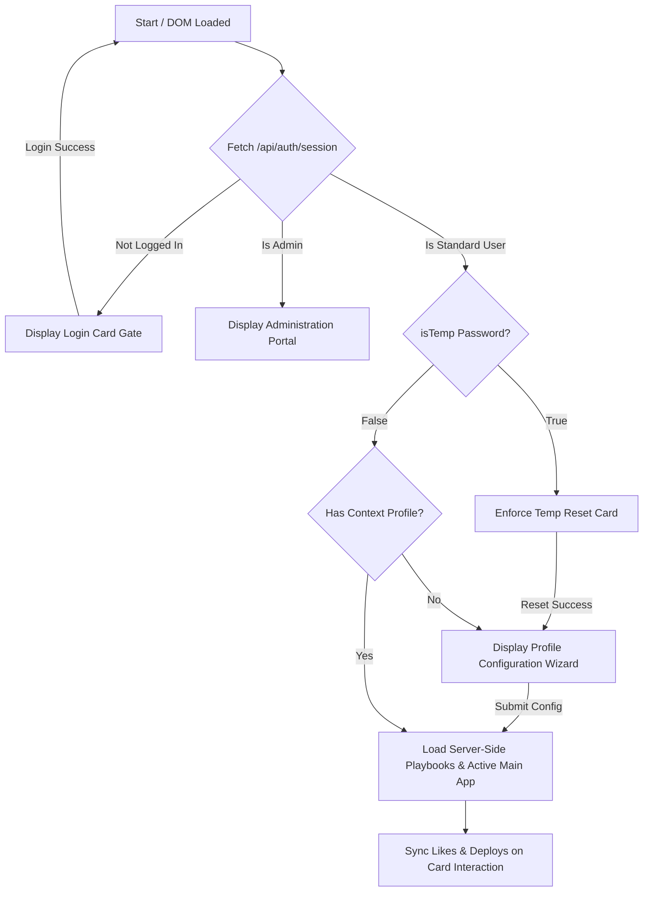

# Gemini Enterprise - Edu Portal Developer Guidelines (`AGENT.md`)

This document serves as the persistent single source of truth for the **Google Gemini Enterprise Education Adoption & Playbook Portal**. It outlines the technology stack, specific coding and terminology preferences, design guidelines, and the current implementation state.

---

## 1. Technology Stack & Architecture

The application is built as a high-fidelity, dynamic web application supported by a secure containerized Node.js backend.

* **Backend Server:** Node.js + Express framework (`server.js`) powering dynamic REST APIs, session storage, and database management.
* **Dual Database Layer:**
  * **Production (PostgreSQL):** Production-ready pool configuration (`pg`) optimized for container scaling on Google Cloud Run.
  * **Local/Offline Fallback (SQLite):** File-based SQLite (`edu_portal.db`) with automatic table structures creation.
* **VM Sandbox Seeding Module:** Securely parses and extracts 14 static scholastic/operational playbooks and translations from `app.js` on first boot inside an isolated Node `vm` context, eliminating seed duplication. Includes a 6-month historical log generator to populate visual analytics out-of-the-box.
* **Authentication Gateways:** Enforced via `express-session` cookies and `bcryptjs` hashing.
  * **Master Admin Account:** `edu_portal_s_admin` with password `HKEduDemo2026`.
  * **Admin Assist Account:** `edu_portal_admin` with password `HKEduDemo` (cannot Create, Update, or Delete use case playbooks).
  * **Standard Accounts:** Email-based provisioning with auto-generated 10-character temp passwords. Force-reset of credentials is strictly enforced on first login.
* **Markup & Client Logic:** Vanilla HTML5 paired with modular ES6+ client-side logic (`app.js`). Hydrates page templates dynamically from `/api/use-cases` on session validation.
* **Styles & Visual Identity:** Pure Swiss Minimalism Vanilla CSS (`style.css`), powered by CSS variable maps. **TailwindCSS is strictly avoided** to preserve precise typographic scale and structural grids.

---


## 2. Terminology & Brand Boundaries

Strict guidelines govern how features, products, and connectors are named. These boundaries must be strictly observed in all UI elements and translations:

### Approved Terminology
* **Enterprise Title:** `Gemini Enterprise - Edu Portal` (Avoid *"Antigravity"* or general references).
* **Main Models & Features:** `NotebookLM` (Never refer to it as *"NotebookLM Enterprise"*), `Gemini`, `Canvas Mode`, `Deep Research`, `Agent Designer`, `Image Generation` (Never use *"Nano Image Gen"*), `Video Generation`.

### Forbidden Terminology
* **Never** use the term **"Gem"** (always use **"Agent"**).
* **Never** use the term **"Copilot"**.

### Localization Boundary
* Keep product and system names (*NotebookLM*, *Gemini*, *Canvas Mode*, *Deep Research*, *Agent Designer*, *Image Generation*, *Video Generation*) strictly in **English** within both Traditional Chinese (`zh-TW`) and Simplified Chinese (`zh-CN`) translations.

---

## 3. Design Aesthetics & Legibility Rules

The portal is designed with a premium, state-of-the-art aesthetic that shifts dynamically between light and dark modes:

* **Dark/Light Mode Theme Variable Management:**
  * Backgrounds, borders, and main cards are driven by CSS variables (e.g., `--bg-primary`, `--border-glass`).
  * Ggradient title elements (like `.welcome-msg`) use dynamic color variables (`var(--welcome-msg-start)` and `var(--welcome-msg-end)`) to prevent low-contrast text failures in light mode. In light mode, headings shift gracefully to elegant dark slate/steel colors rather than retaining light/white gradients.
* **Icon Softening:**
  * Utility icons inside side panels and secondary items use soft muted colors (`var(--text-muted)`) rather than stark black/white colors, ensuring a quiet, premium aesthetic that lights up elegantly on active hover states.
* **No Placeholders:**
  * Standard icons are rendered using the Google Material Symbols Outlined font library.
  * Overlapping UI buttons (such as the **Copy Prompt** button in the sandbox drawer) are properly padded to ensure clear separation and zero element overlapping.

---

## 4. Connector & Dynamic State Logic

The portal supports intelligent integration simulation via simulated enterprise connector toggles:

* **Nomenclature:**
  * All connector components are named generically in user-facing toasts and badges to ensure product agnosticism (e.g., **Drive Connector**, **Email Connector**, **Calendar Connector**, **LMS Connector**) rather than referencing vendor-specific software (like *Outlook* or *OneDrive*).
* **Essential Connectors vs. Optional Connectors:**
  * Use cases that strictly require an active integration (e.g., **Daily Academic Email Digest & Priority Planner**) carry a `connectorEssential: true` tag. These cards strictly show a locked overlay on the dashboard when their corresponding connector is toggled off.
  * Use cases where integrations are secondary enhancements (e.g. *Sentiment Feedback*, *Activities Calendar*) are tagged with `connectorEssential: false`. These cards remain **unlocked** on the dashboard and accessible to click at all times.
* **Modal Advanced Toggle:**
  * Inside the detailed modal view for non-essential connector use cases, an interactive slider checkbox ("Extend to Advanced Usage with Connectors") is rendered.
  * Toggling this checkbox instantly swaps the steps, prompts, and pro-tips between standard manual file upload variants and active cloud connector workflows.

---

## 5. Current Implementation State

The following dynamic authorization, session gating, and admin workflows are 100% verified, compiled, and operational:



* **Instant Translation Chain:** Language switches translate the full portal, sidebar filters, active user context metrics, and interactive toasts in real-time.
* **Product-Agnostic Notifications:** Simulating connectors issues clean native toasts, fully localized across English (`en`), Traditional Chinese (`zh-TW`), and Simplified Chinese (`zh-CN`).
* **Interactive Preferences (Likes/Deployments):** Standard use case cards carry responsive heart and rocket icons that bypass detail popups, updating preference tables dynamically on the server database.
* **SVG Vector Graph Charts:** The admin statistics view aggregates database events and paints high-contrast line charts showing Page Views, Likes, and Deployments over the last 6 months.

---
## 6. Cloud Run Production Deployment

The production environment is deployed and scaled on **Google Cloud Run** to serve the active user base with high-availability:

* **Service Name:** `edu-ge-learning-portal`
* **GCP Project:** `ge-edu-demo`
* **Active Region:** `asia-east2` (Hong Kong)
* **Production Endpoint URL:** [https://edu-ge-learning-portal-1069209637728.asia-east2.run.app](https://edu-ge-learning-portal-1069209637728.asia-east2.run.app)
* **Access Mode:** Domain-restricted access (enforced via active Organization Policies). Public unauthenticated access (`allUsers` binding) can be added by temporarily bypassing domain restriction constraints in the GCP Console.
* **Cleanup Status:** Old duplicate deployments (`ge-edu-portal` and its Artifact Registry repository in `us-west1`) have been fully deleted and pruned.

### Standard Deployment & Release Workflow

To compile and deploy updates or new releases of the portal to the live production environment, follow this standardized step-by-step workflow:

1. **Verify Local Assets & Configuration:**
   * Ensure that `style.css`, `app.js`, `index.html`, and `server.js` contain no syntax errors and all dynamic references are correct.
   * Verify that local testing configurations do not override the production database environment values.

2. **Authenticate with Google Cloud SDK:**
   * Ensure you are authenticated with your authorized Google Cloud developer account:
     ```bash
     gcloud auth login
     ```

3. **Deploy Codebase to Google Cloud Run:**
   * Execute the standardized source-deployment command in your terminal within the root directory of the repository:
     ```bash
     gcloud run deploy edu-ge-learning-portal --source . --region asia-east2 --allow-unauthenticated --project ge-edu-demo
     ```
   * *Note on builds:* Google Cloud Run automatically leverages the root `Dockerfile` to compile and containerize the environment via Cloud Build, saving the resulting artifact within Artifact Registry in `asia-east2`.

4. **Verify Access & Organization Policies:**
    * If organization policies block public unauthenticated access, log in using your workspace domain credentials to access the production URL.
    * If public unauthenticated access is permitted by your organization policies, override the invoker role binding via:
      ```bash
      gcloud run services add-iam-policy-binding edu-ge-learning-portal --region=asia-east2 --member=allUsers --role=roles/run.invoker --project=ge-edu-demo
      ```

### Agent-Driven Deployment & Version Control Workflow

To streamline development, ensure version history consistency, and automate production releases, the following **Agent-Driven Deployment & Version Control Workflow** is followed:

#### Step 1: Git Commit & Push (Version Control)
Whenever the AI coding agent successfully implements code modifications, bug fixes, or enhancements, the agent must immediately stage, commit, and push the revisions to the remote GitHub repository under the user account **MrRoyRoy**:

1. Configure the Git author credentials locally:
   ```bash
   git config user.name "MrRoyRoy"
   git config user.email "yuwcheung@gmail.com"
   ```
2. Stage and commit the modified files with a descriptive, professional commit message:
   ```bash
   git add .
   git commit -m "feat: [Descriptive Title of Accomplished Revisions]"
   ```
3. Push the local commits to the upstream repository branch:
   ```bash
   git push
   ```

#### Step 2: Live Cloud Run Production Deployment
Once version control has been synced, the agent triggers a live source-deployment to update the production container environment:

```bash
gcloud run deploy edu-ge-learning-portal --source . --region asia-east2 --allow-unauthenticated --project ge-edu-demo
```

#### Step 3: Post-Deployment Documentation & Anonymization Checks
Following any deployment of modifications, enhancements, or bug fixes:
1. **Assess README Relevance**: Review the `README.md` file completely to determine if any setup instructions, schemas, commands, or feature descriptions need updating to reflect the new state.
2. **Anonymize Environment-Specific Details**: Before staging and pushing changes, double-check that **no custom environment-specific parameters, identifiers, or password credentials** are saved inside `README.md`. Replace the following with generic `<PLACEHOLDERS>` in `README.md`:
   * Project ID (e.g. use `<YOUR_GCP_PROJECT_ID>` instead of `ge-edu-demo`)
   * Region (e.g. use `<YOUR_GCP_REGION>` instead of `asia-east2`)
   * Service Identity (e.g. use `<YOUR_CLOUD_RUN_SERVICE_NAME>` instead of `edu-ge-learning-portal`)
   * Database Instance Name (e.g. use `<YOUR_DATABASE_INSTANCE_NAME>` instead of `edu-portal-db`)
   * Custom administrative and super-admin passwords (always use placeholder tags and never store actual secrets in plain-text inside git).
   * Personal workspace emails, account tokens, or custom IP addresses.
3. **Password Recovery Warning**: Ensure that any credentials setup guide contains a warning noting that there is **no recovery mechanism** for customized administrative passwords, and that they must be documented and kept secure.

#### GitHub Token & Secrets Storage
* **GitHub Personal Access Token (PAT):** Saved securely in the local project workspace in the [gp](file:///Users/roycheung/Desktop/dev-projects/edu-ge-adoption-portal/gp) file. This token authorizes push workflows and repository management actions.

---

############# 7. App State & Progress
 
##### Accomplished Tasks (Latest Session Milestone)
* **Standardized Product-Agnostic Connectors (100% Complete):**
  * **Restored Missing Connector Form Controls:** Added the missing **LMS Connector** and **Calendar Connector** checkboxes back to the admin Use Case edit/creation modal, giving admins full power to configure all four simulated integration lock-overlays.
  * **Adopted Product-Agnostic Nomenclature:** Replaced old legacy vendor-specific checkboxes ("OneDrive", "Google Drive", "Email") with clean product-agnostic options: **Drive Connector**, **Email Connector**, **LMS Connector**, and **Calendar Connector** in perfect alignment with AGENT.md brand guidelines.
  * **Robust Backward-Compatible Hydration:** Implemented case-insensitive mapping logic to translate legacy database fields safely (such as `"OneDrive"`, `"GoogleDrive"`, and `"Email"`) to our premium generic connectors upon form hydration, preventing form state data-loss when saving edited records.
* **Structured Primary Role Context Dropdown (100% Complete):**
  * **Converted Free-text to Select Dropdown:** Replaced the fragile free-text input field in the Use Case form with an elegant select dropdown containing standard institution roles (`Lecturer`, `TA`, `Student`, `Program Leader`, `Dean`, `IT Admin`, `SAO`, `Security`, `Finance`).
  * **Bilingual Translation Support:** Integrated dynamic translation callbacks to automatically localize the options inside the admin role dropdown whenever the active portal language changes.
  * **Intelligent AI Role Mapping:** Built an algorithmic setter to dynamically parse Vertex AI Gemini-assisted playbooks, case-insensitively mapping suggested text roles (including natural variations like "teacher", "sysadmin", "educator") to our precise predefined dropdown values.
* **Boot-Time Database Synchronization (100% Complete):**
  * **Automatic Seed Reconstruction:** Extended the sandboxed database seeding engine inside `server.js` to automatically synchronize and rebuild both the `"su_helpdesk"` and `"at_risk_cohort"` default configurations on boot. This ensures that the `"at_risk_cohort"` early-warning system's essential `LMS Connector` and `SIS Database Connector` definitions are safely reconstructed in existing SQLite/PostgreSQL instances.
* **Continuous Integration & Cloud Run Releases (100% Complete):**
  * **Automated Git Push:** Configured git identity and committed all changes securely, pushing code updates safely to the upstream repository.
  * **Google Cloud Run Production Deployment:** Executed source-based container builds via Cloud Build, rolling out revision updates directly to the live production endpoint serving active student/faculty traffic.
* **AI Playbook Suggestion & Comparison Enhancement (100% Complete):**
  * **Gemini Metadata Suggestions Enabled:** Updated the backend prompt schema inside `server.js` to allow the Vertex AI Gemini model to update and recommend modifications to **Required Gemini Features**, **Required Connectors**, and the **Enable Dual-Mode Template with Advanced Prompt** flag based on user instructions.
  * **Interactive Form Hydration:** Upgraded `applyGeminiSuggestions` in `app.js` to dynamically check/uncheck the features and connectors checkboxes and toggle the Dual-Mode form state when suggestions are accepted. Standardized form values are populated for both modes to ensure zero-field-loss on save.
  * **Side-by-Side Metadata Diff Viewer:** Extended `showDiffViewer` inside `app.js` to compile and display comparative side-by-side diff comparisons for Features, Connectors, and Dual-Mode flags, making all structural revisions completely transparent.
  * **Smart Multi-Mode Rendering:** Configured the diff viewer to render advanced prompt comparisons if Dual-Mode is active on either the current or the suggested version, preventing hidden field updates.

### Next Steps & Continuous Polish
1. **User Onboarding Validation:** Continuously monitor portal signups and onboarding wizard completions to confirm error-free role filter matches.
2. **AI Tuning Oversight:** Monitor prompt drafting response payloads to verify consistent product-agnostic naming under complex custom instructions.
3. **Log Analytics Backup:** Validate SVG trend charts for real-time Page View and Deployment tracking.
