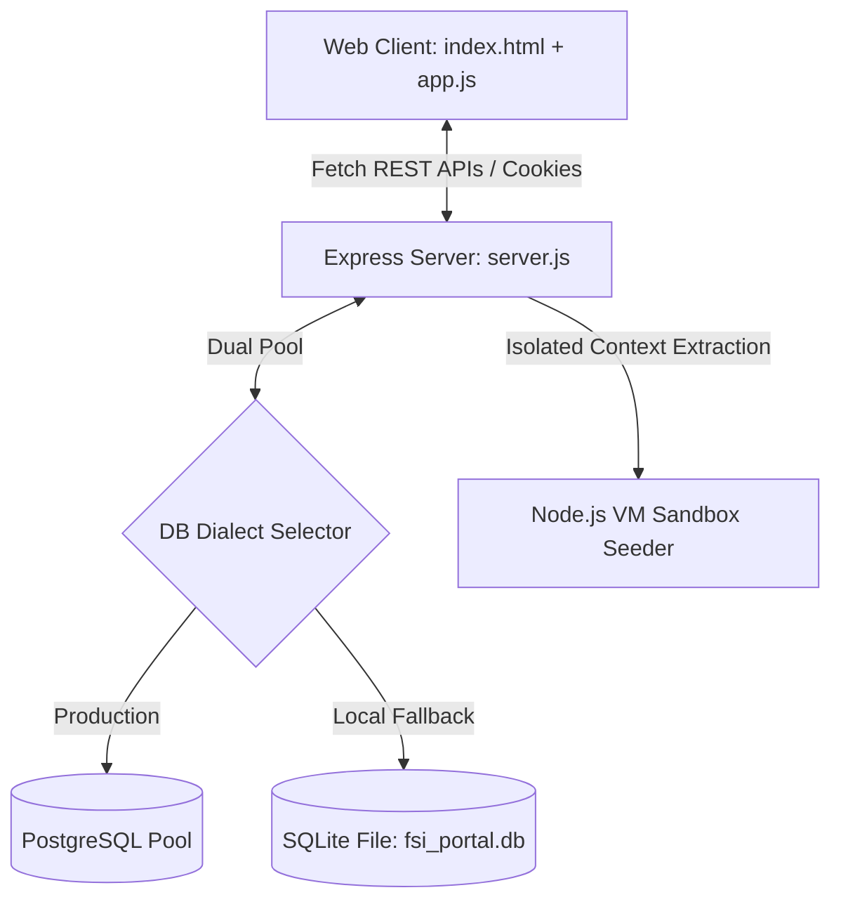
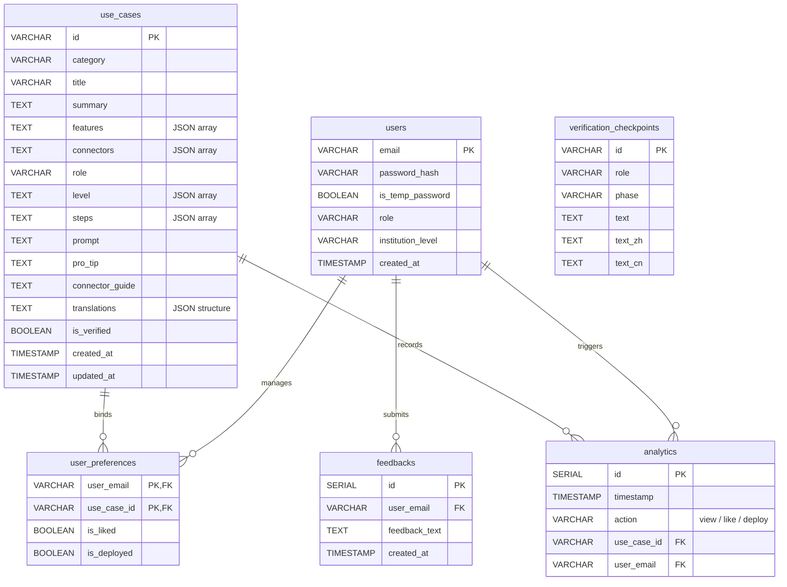

# Gemini Enterprise - FSI Adoption & Playbook Portal

[](#cloud-production-deployment)
[](#technology-stack)
[](#localization-dictionaries)

Welcome to the **Gemini Enterprise FSI Adoption & Playbook Portal**, a high-fidelity, premium adoption roadmap and playbook orchestration platform for the Financial Services Industry (FSI). Custom-tailored for banking, insurance, and capital market sectors, this system provides financial analysts, relationship managers, credit underwriters, compliance officers, and operations teams with interactive, role-specific Gemini adoption pathways, interactive sandboxes, visual analytics, and persistent feedback collection loops.

---

## 📖 Table of Contents
1. [Core Features](#-core-features)
2. [Technology Stack](#-technology-stack)
3. [Architecture & DB Schemas](#-architecture--db-schemas)
4. [Role-Specific Onboarding & Workflows](#-role-specific-onboarding--workflows)
5. [Local Development & Setup](#-local-development--setup)
6. [Cloud Production Deployment](#-cloud-production-deployment)
7. [Automated Provisioning (Terraform)](#-automated-infrastructure-provisioning-terraform)
8. [Version Control & Release Workflow](#-release--code-update-workflows)

---

## 🌟 Core Features

### 📅 Dual-Track Chronological Timeline (View A)
A symmetrical, highly structured horizontal roadmap divided into key 18-month strategic rollout stages.
* **Track 1 (Strategic Rolloout Phases)**: Houses four color-coded phase nodes (Indigo, Amber, Emerald, Blue, Coral, Purple) complete with separate progress tracking bars:
  * **Month 1**: Foundation Setup (Tech Provisioning)
  * **Months 2-3**: Core Pilots & Launch
  * **Months 4-9**: Division Expansion (Evaluation Pilot)
  * **Months 10-18+**: Enterprise Scale (Exam Prep & Audit)
* **Track 2 (Continuous Rolling Initiatives)**: Designed as a continuous, thick progress pipeline capsule with interactive arrowhead anchors to represent continuous, rolling initiatives (e.g. Identity Providers & Security and Governance Compliance).

### 🌀 Isometric SVG Winding Verification Pipeline (View B)
An advanced engineering checklist system built on top of a futuristic grid layout:
* **Metallic 3D Pipeline**: Drawn with linear gradient SVG sheets, sheen gloss layers, and connector rings.
* **Pulsating Joints**: 5 glowing joints pulsating matching specific timeline phases.
* **Reactive Strikethroughs**: Completing phase checklist tasks triggers automatic line strikethroughs, joint glows, and dynamically transforms node colors into brilliant emerald rings.

### 🧪 Advanced Prompt Sandbox & Diff Viewer
* **Dynamic Connectors (5-Connector Model)**: Playbook cards simulate enterprise connector toggles:
  1. **Document Store Connector** (SharePoint, OneDrive, Google Drive)
  2. **Email Connector** (Outlook, Gmail, Exchange)
  3. **CRM Connector** (Salesforce, Wealthbox, Dynamics)
  4. **Calendar Connector** (Google Calendar, Outlook Calendar)
  5. **Service Desk & KB Connector** (Confluence, ServiceNow, Jira Service Management)
* **Frosted Glass Lock**: If an *essential* connector is toggled off, the card is locked with a modern frosted-glass overlay.
* **Advanced Usage**: Toggling the advanced connector mode dynamically swaps steps, complex prompt payloads, and pro-tips between manual operations and cloud API workflows.
* **Gemini LLM Prompt Refiner**: Submit prompt changes to a mock Gemini LLM, which renders side-by-side color-coded syntax Diff comparisons (Current Draft vs Optimized suggestions).

### 📊 Real-time Administrative Telemetry
* Fully responsive data administration console plotting high-contrast vector line charts of cumulative Page Views, Likes, and Deployments compiled over a rolling 6-month historical log.
* Dynamic user provisioning tools supporting automatic creation, temporary password force-resets, and role switching.

### 💬 Persistent Universal Feedback Loops
* A beautiful fixed floating feedback button styled with linear-gradient, scale-up micro-animations, and modern glassmorphism.
* Automatically records the submitter's email context and provides an exclusive **User Feedbacks** console inside the Admin dashboard, restricted solely to the super-admin account, supporting real-time suggestions review and dismissals (crossing-off).

---

## 🛠 Technology Stack

* **Client Engine**: Vanilla HTML5, ES6+ JavaScript modules, and Material Symbols font icons.
* **Visual Styling**: Swiss-minimalist Vanilla CSS (`style.css`) utilizing standard layout grids, CSS variable maps (supporting Light and Dark modes), and dynamic micro-animations. **TailwindCSS is strictly avoided** to preserve precise typography.
* **Server Framework**: Node.js + Express (`server.js`) supporting session tracking via secure cookies and Bcrypt authentication hashing.
* **Dual Database Layer**:
  * *Production*: Scaled PostgreSQL client pooling (`pg`) optimized for container scaling on Google Cloud.
  * *Development/Fallback*: File-based SQLite database engine (`fsi_portal.db`) with automated schema bootstraps.
* **Isolated VM Sandbox Parser**: Uses a Node.js isolated `vm` context to extract and seed 14 static financial/operational playbooks and translations directly from the client script (`app.js`) upon first boot, preventing data duplication.

---

## 🏗 Architecture, Database Schema & Entity-Relationship (ER) Diagram

### System Architecture Pipeline



### Entity-Relationship (ER) Diagram



### Database Schema Table Definitions

#### 1. Users Table (`users`)
Stores user session credentials, authorization, onboarding role configurations, and temporary password parameters:
* `email` (Primary Key, VARCHAR/TEXT)
* `password_hash` (TEXT, Not Null)
* `is_temp_password` (BOOLEAN, Default True)
* `role` (VARCHAR, Default Null)
* `institution_level` (VARCHAR, Default Null)
* `created_at` (TIMESTAMP)

#### 2. Editable Playbooks (`use_cases`)
Stores the dynamic FSI use case playbook structures, localized translations, and user popularity counters:
* `id` (Primary Key, VARCHAR)
* `category` (VARCHAR, Not Null)
* `title` (VARCHAR, Not Null)
* `summary` (TEXT, Not Null)
* `features` (TEXT, Not Null) - JSON-encoded string list.
* `connectors` (TEXT, Not Null) - JSON-encoded string list.
* `role` (VARCHAR, Not Null) - Target professional institutional persona.
* `level` (TEXT, Not Null) - Target expertise tier JSON.
* `steps` (TEXT, Not Null) - Playbook execution steps JSON.
* `prompt` (TEXT, Not Null) - Base optimized system/assistant prompt string.
* `pro_tip` (TEXT, Not Null) - Advanced pro-tip guidance.
* `connector_guide` (TEXT) - Explanations for dynamic connector integrations.
* `translations` (TEXT, Not Null) - Full localization JSON dictionary.
* `is_verified` (BOOLEAN, Default False)
* `created_at` (TIMESTAMP)
* `updated_at` (TIMESTAMP)

#### 3. User Preferences (`user_preferences`)
Keeps track of high-fidelity user actions (bookmarks/likes and cloud deployments) to prevent duplication:
* `user_email` (Primary Key, VARCHAR, Foreign Key referencing `users(email)`)
* `use_case_id` (Primary Key, VARCHAR, Foreign Key referencing `use_cases(id)`)
* `is_liked` (BOOLEAN, Default False)
* `is_deployed` (BOOLEAN, Default False)

#### 4. Telemetry Analytics (`analytics`)
Collects and aggregates metrics to display continuous rolling trends in the admin dashboard:
* `id` (Primary Key, SERIAL/AUTOINCREMENT)
* `timestamp` (TIMESTAMP, Default Current Time)
* `action` (VARCHAR, Not Null) - Event type: `'view'`, `'like'`, or `'deploy'`.
* `use_case_id` (VARCHAR, Nullable, Foreign Key)
* `user_email` (VARCHAR, Nullable, Foreign Key)

#### 5. Feedbacks Table (`feedbacks`)
Stores and compiles persistent suggestions submitted via the floating glassmorphic feedback component:
* `id` (Primary Key, SERIAL/AUTOINCREMENT)
* `user_email` (VARCHAR, Not Null)
* `feedback_text` (TEXT, Not Null)
* `created_at` (TIMESTAMP)

#### 6. Verification Checkpoints Table (`verification_checkpoints`)
Caches dynamic, role-specific milestone checklist items for visual rendering in the metallic SVG timeline view:
* `id` (Primary Key, VARCHAR)
* `role` (VARCHAR, Not Null)
* `phase` (VARCHAR, Not Null)
* `text` (TEXT, Not Null) - English checkbox description.
* `text_zh` (TEXT, Not Null) - Traditional Chinese description.
* `text_cn` (TEXT, Not Null) - Simplified Chinese description.

---

## 💻 Local Development & Setup

This application is built with vanilla aesthetics and zero heavy compilation steps, making it incredibly fast and lightweight to spin up locally.

### Prerequisites:
* **Node.js**: Recommended version `18.x` or later.
* **NPM**: Package manager (comes bundled with Node.js).
* **Git**: Version control client.

### Step-by-Step Installation:

#### 1. Clone the Repository:
```bash
git clone https://github.com/MrRoyRoy/ge_learning_portal_fsi.git
cd ge_learning_portal_fsi
```

#### 2. Install Server Dependencies:
```bash
npm install
```

#### 3. (Optional) Configure Environment Variables:
If you want to configure custom admin credentials, set up environment variables or a local `.env` file:
```bash
export SUPER_ADMIN_PASSWORD="YourSecureSuperAdminPassword"
export ADMIN_PASSWORD="YourSecureAdminAssistantPassword"
```
*Note: If no variables are supplied, development sessions automatically fall back to safe local-only development placeholders (`SuperAdmin_ChangeMe_2027` and `Admin_ChangeMe_2027`).*

#### 4. Launch the Server:
```bash
npm start
```
Upon booting, the application will automatically:
1. Detect that there is no local database file.
2. Initialize and seed a clean file-based SQLite database (`fsi_portal.db`) in the root.
3. Use the VM isolated seeder module to parse and backfill all 15 FSI playbooks and custom checklists.
4. Populate a 6-month synthetic log telemetry dataset so visual graphs load instantly.
5. Start listening on `http://localhost:8080`.

#### 5. Open in Web Browser:
Navigate to **[http://localhost:8080](http://localhost:8080)** to start testing!

---


## ☁️ Cloud Production Deployment

The portal is scale-optimized for serverless execution on **Google Cloud Run** connected securely to a **Google Cloud SQL PostgreSQL** instance.

### Production Environment Requirements:
* **Cloud Run Service Service Account**: Needs the **Cloud SQL Client** (`roles/cloudsql.client`) permission to access the serverless instance sockets.
* **Environment Variables**:
  * `DATABASE_URL`: Connection string in Unix socket syntax (`postgres://<user>:<pwd>@/<db_name>?host=/cloudsql/<instance_connection_name>`).
  * `DISABLE_PG_SSL`: Set to `true` (SSL must be bypassed on local Cloud Run Unix sockets).
  * `NODE_ENV`: Set to `production` (enforces secure session cookies).

---

## 🛠️ Automated Infrastructure Provisioning (Terraform)

We provide modular, production-grade **Terraform** configurations to automate spinning up completely fresh environments in minutes.

The scripts reside in the `/terraform` subdirectory and provision:
1. **Google Cloud APIs**: Automatically activates Cloud Run, Cloud SQL, and Artifact Registry.
2. **Cloud SQL Instance**: Sets up a PostgreSQL 15 database (`db-f1-micro` tier) in your region.
3. **Database & Master Credentials**: Provisions the schema database `fsi_portal` and secures credentials.
4. **IAM Permissions Binding**: Grants Cloud SQL Client access to your Cloud Run service identity.
5. **Cloud Run Service**: Deploys the service linked with connection sockets and correct environment configurations.
6. **Public Ingress Access Binding**: Configures `allUsers` IAM member for public website viewing.

### How to Deploy a New Environment with Terraform:

#### 1. Navigate to the Terraform Directory:
```bash
cd terraform
```

#### 2. Initialize the Providers & Modules:
```bash
terraform init
```

#### 3. Customize Your Variables:
Create a custom `terraform.tfvars` file to override default settings (GCP project, region, database password):
```hcl
project_id           = "ge-fsi-demo"
region               = "asia-east2"
service_name         = "fsi-ge-learning-portal"
db_instance_name     = "fsi-portal-db"
db_password          = "your-postgres-master-password"
super_admin_password = "your-master-superadmin-password"
admin_password       = "your-admin-assistant-password"
```

#### 4. Preview the Provisioning Infrastructure Plan:
```bash
terraform plan
```

#### 5. Apply and Provision Infrastructure:
```bash
terraform apply -auto-approve
```
Upon successful provisioning, Terraform will display your active **Service URL** and **Database Connection Name** inside outputs.

---

## 📈 Release & Code Update Workflows

To compile and re-deploy your container image via Google Cloud Build and deploy it to Cloud Run, execute:
```bash
gcloud run deploy fsi-ge-learning-portal --source . --region asia-east2 --allow-unauthenticated --project ge-fsi-demo
```

*Made with 💜 for advanced agentic software deployments and persistent financial services portals.*
